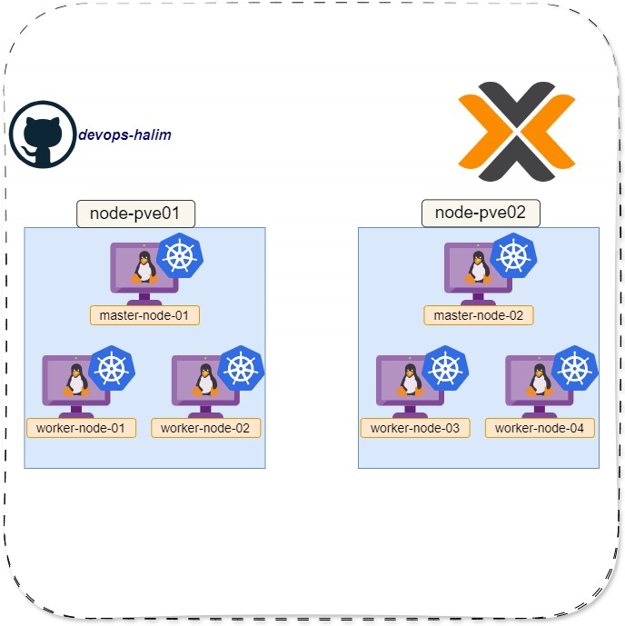

# __Kubernetes Cluster (K3s)__

This document outlines the configuration and structure of a K3s cluster hosted on Proxmox virtual machines running Debian 12, with the VMs provisioned using OpenTofu.

## Cluster Components:

* __Master Nodes:__ 2 master nodes for high availability.

* __Worker Nodes:__ 4 worker nodes for application workloads.

## Hosting Environment

- Hypervisor: Proxmox VE

- Operating System: Debian 12

## Diagram

Below is the diagram representing the cluster's architecture:

